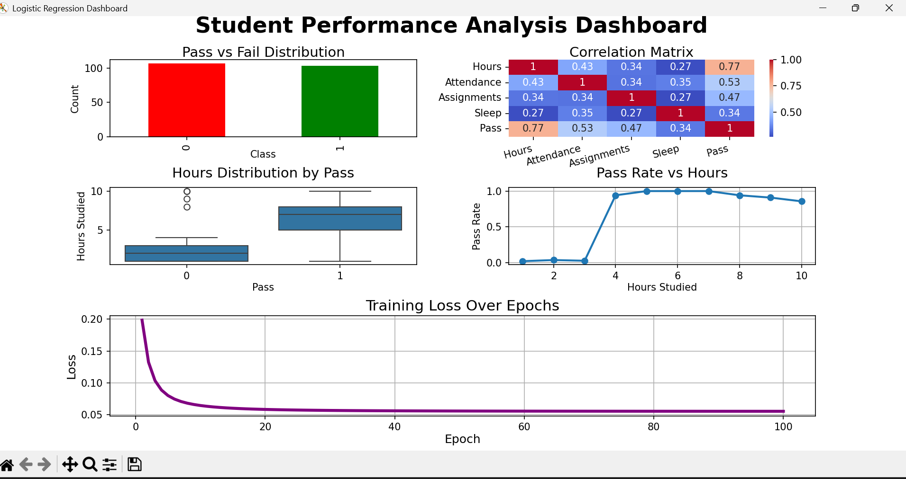

# Logistic Regression From Scratch

A complete implementation of Logistic Regression built entirely from scratch using Python without using machine learning libraries such as Scikit-Learn.

The goal of this project was not only to achieve high accuracy, but also to deeply understand how Logistic Regression works internally, including training, optimization, preprocessing, evaluation, and visualization.

---

## Features

- Logistic Regression from scratch
- Multi-feature support
- Gradient Descent optimization
- Sigmoid activation function
- Binary classification
- Min-Max Normalization
- Train/Test Split
- Data Leakage prevention
- Early Stopping
- Accuracy evaluation
- Confusion Matrix evaluation
- Visualization Dashboard

---

## Project Structure

```text
ML_From_Scratch_V1/

├── data/
│   └── student_pass.csv

├── Models/
│   └── logistic_regression.py

├── preprocessing/
│   └── preprocessing.py

├── Metrics/
│   └── metrics.py

├── Notes/
│   └── lessons_learned.md
├── experiments/
│   ├── visualization.py
│   └── losses.json

├── dashboard.png

├── README.md

└── train.py
```
---

## Implemented From Scratch

The following components were implemented manually without machine learning libraries:

- Sigmoid Function
- Logistic Regression
- Gradient Descent
- Weight Updates
- Bias Updates
- Train/Test Split
- Min-Max Normalization
- Classification Threshold
- Accuracy Metric
- Confusion Matrix
- Early Stopping

---

## Machine Learning Pipeline

```text
Load Dataset
      ↓
Shuffle Data
      ↓
Train/Test Split
      ↓
Normalize Train Data
      ↓
Normalize Test Data
      ↓
Train Logistic Regression
      ↓
Generate Probabilities
      ↓
Classify Predictions
      ↓
Evaluate Accuracy
      ↓
Analyze Results
      ↓
Visualization Dashboard
```

---

## Visualization Dashboard

The project includes a dashboard containing:

- Pass vs Fail Distribution
- Correlation Matrix
- Hours Distribution by Pass Status
- Pass Rate vs Hours
- Training Loss Over Epochs


## Dashboard Preview


---

## Example Results

```text
Train Size : 168
Test Size  : 42

Accuracy   : 95.24%

TN : 23
FP : 1
FN : 1
TP : 17
```

The model correctly classified 40 out of 42 test samples.

---

## Concepts Learned

During this project I learned:

- Samples vs Features
- Weights and Bias
- Logistic Regression
- Gradient Descent
- Feature Scaling
- Normalization
- Train/Test Split
- Data Leakage
- Model Evaluation
- Visualization and Analysis
- Early Stopping
- Confusion Matrix

---

## Run

```bash
python train.py
```

---

## Author

Mahmoud Mostfa Taha

Machine Learning Student